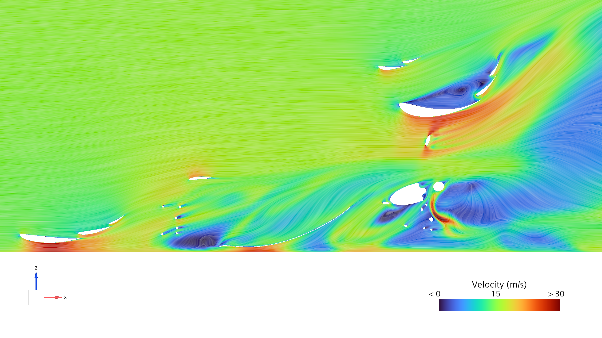

# Rear Wing Flow Visualization

**Berkeley Formula Racing - B26 - On-track testing at competition speed**

I conducted two independent flow visualization methods on the B26 rear wing flaps (elements 2 and 3), both run on track at full competition speed: surface oil flow visualization, and yarn tufts filmed from an onboard rearward-facing GoPro camera. The flow-viz is a fluorescent mixture of kerosene oil and pigment applied on test sections before running the car, where local shear streaks it in the direction of flow. Regions with clean, near-invisible streaks mark high-shear attached flow, while pooling or splotching marks low shear separated flow. The tufts show the direction and quality of flow in real time. Between them, and analyzed against CFD, they identify the same spanwise structure three different ways. Additionally, in one case, identifying a mechanism a pattern that neither mechanism could explain on its own. 

## The spanwise structure

Full-car CFD shows flow varying strongly across span in the rear wing and driver-head regions. Near the swan neck mounts (first image) the flow stays relatively well attached, and the streamlines are straight and organized. Exactly at midplane (second image) and in the wake of driver-head, a closed recirculation bubble appears, visible as a tight vortex core. And finally, near the endplates (third image), a secondary vortex core forms, this time higher up and closer to the first flap. 

CFD of the rear wing and driver-head region shows the flow varying strongly across the span. Near the swan-neck mounts the flow stays attached, streamlines tight and organized. On the midplane, in the wake of the driver's head, a closed recirculation bubble forms, visible as a tight vortex core:

Analyzing slices across the span, the pattern is: recirculation reaching up to flap 1 at roughly y=-0.1 (behind the driver's head) and again at y=-0.4 (near the endplate), with a clean band between them at y=-0.2 showing very strong attachment.

Both experimental methods find that same band independently.

## Tufts

<video autoplay loop muted playsinline width="100%" poster="figures/tufts-still.png">
  <source src="figures/tufts-video.mp4" type="video/mp4">
  Video not supported in this browser. See the still frame above.
</video>

Across the full clip, tufts nearest and directly behind the swan necks stay flat and attached for the entire run and never separate once. Directly behind the driver's head, between the swan necks, the tufts move constantly, consistent with the recirculation bubble CFD predicts at that station.

Further outboard toward the endplates, the picture is more interesting: tufts stay attached through straight-line sections but separate in corners. The current straight-line CFD model cannot fully confirm this match, since streamlines close to the mainplane at the y=-0.4 slice are relatively well-behaved (recirculation is displaced in the +Z direction), so this remains an open finding. The footage demonstrates a strong corner-dependent flow state that a straight-line simulation has no way to predict. Future iterations on trackside testing would involve a direct comparison against a cornering simulation.

## Oil-flow, pressure side

Flap 2 (topmost element) is mostly  clean, with minimal clumps and pooling, and is consistent spanwise and chordwise.

Flap 1 (between flap 1 and mainplane) shows more structure. There are two or three vertical clumps on either side near mid-span, directly behind the driver's head and slightly outboard. There is also a large patch near the endplate. Additionally, there is a clear gap between the mid-span clumps and the outboard patch, and that gap sits at the spanwise station where CFD shows clean flow. The oil-flow, the tufts, and the CFD all place the attached band in roughly the same Y location.

Note: some pooling near the leading edge is an artifact rather than a flow feature. The mixture was sprayed on and the car took a moment to idle before launch, so gravity streaked some of it before there was any airflow to influence the paint. Pooling from gravity looks very similar to pooling from low shear. In future tests for B27, I will make sure to apply the paint to test sections moments before launch. 

Further analysis with Q-criterion isosurfaces in CFD (threshold 10,000 s⁻²) from the same simulation shows discrete streamwise vortex cores shedding off the wing at close to the same spanwise stations as the clumps from the flow-viz testing. 

The clumps on flap 1 and the less-visible streaks on flap 2 are not an artifact from a delayed launch. They are the surface footprint of vortices that CFD predicts propagating through almost exactly those locations.

## Oil-flow, suction side

The suction side shows a pronounced sawtooth streaking pattern, fine and closely spaced, running almost the full span of the element.

The same Q-criterion field partially explains this too. From behind, the simulation shows a row of discrete vortex structures sitting close to where the sawtooth appears:

The mechanism is the same one behind the pressure-side clumps: streamwise vortex legs, cleared by high shear where they pass and leaving pooled oil in the low-shear gaps between them.

What does not yet match is the scale. CFD resolves roughly six or seven distinct vortex legs across the span, unevenly spaced and clustered mainly behind the driver's head and near endplates. The real wing shows around thirteen, closely and evenly spaced streaks running almost uniformly across the entire span, a much finer spatial wavelength than anything in the simulation. Our straightline CFD simulation resolved the correct physics and the right general location, but the real flow is shedding vortices at a spacing the simulation is not able to fully capture. 

A likely explanation is that this is a steady state RANS limitation rather than a modeling error. Evenly-spaced spanwise instability is an inherently unsteady feature, and a steady solver tends to only resolve larger, discrete structures tied to explicit geometric features, in this case the driver's head, rather than a fine, regular pattern across a mostly uniform span. Confirming this would require a much finer mesh or an unsteady simulation. 

## Why testing matters

On-track testing is the only qualitative method we utilize to correlate CFD findings with real-life results; our CFD is meaningless if it does not accurately represent how air behaves around our car. The spanwise result is our strongest confirmation: strong recirculation behind the driver's head, an attached band outboard of it, separation near the endplate, all identified independently in CFD, tufts, and flow-viz. The vortex correlation then goes a step further by identifying the physical mechanism causing the streaking pattern on both pressure and suction side surfaces. The remaining discrepancy (spacing uniformity) now highlights the next specific question to look into, whether through an unsteady RANS simulation or a study specifically for resolving finer vortices.  
