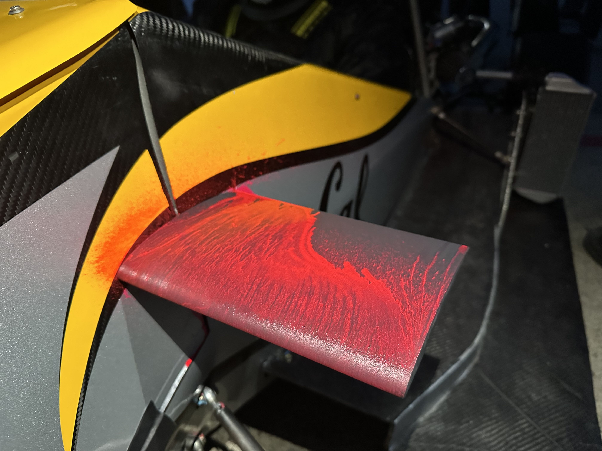
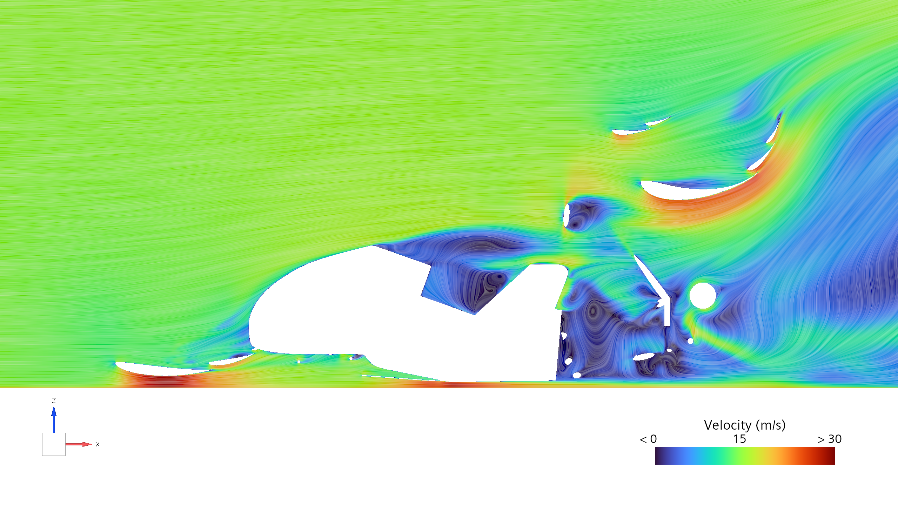
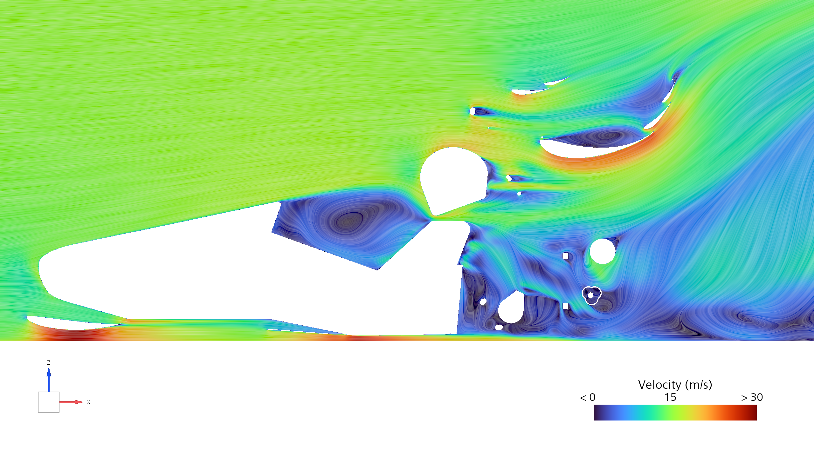
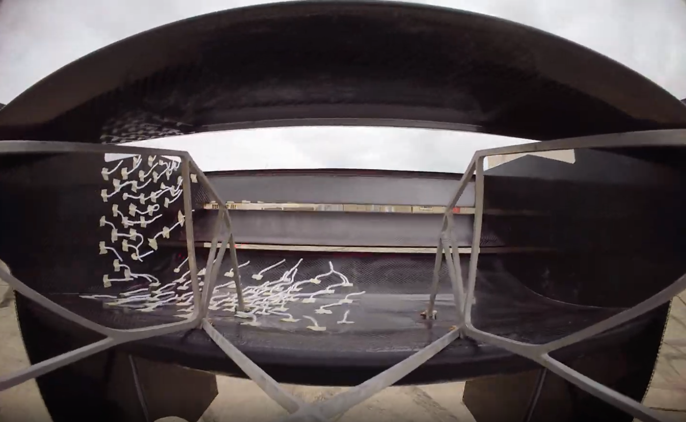
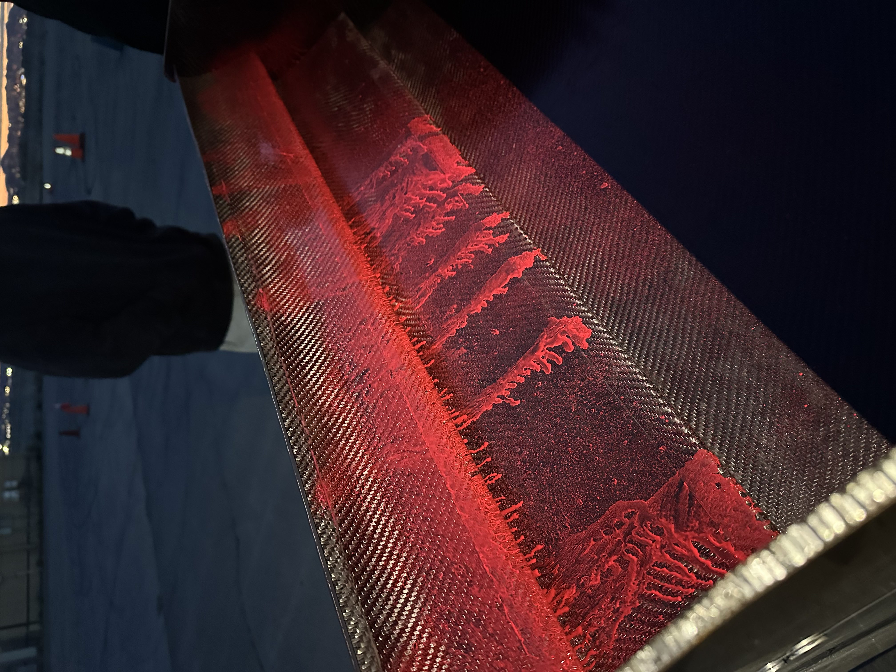
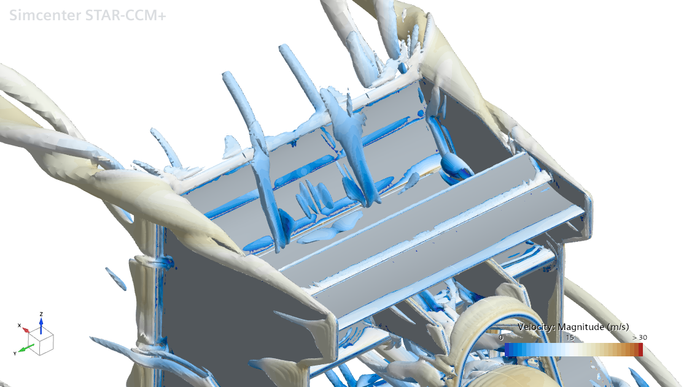
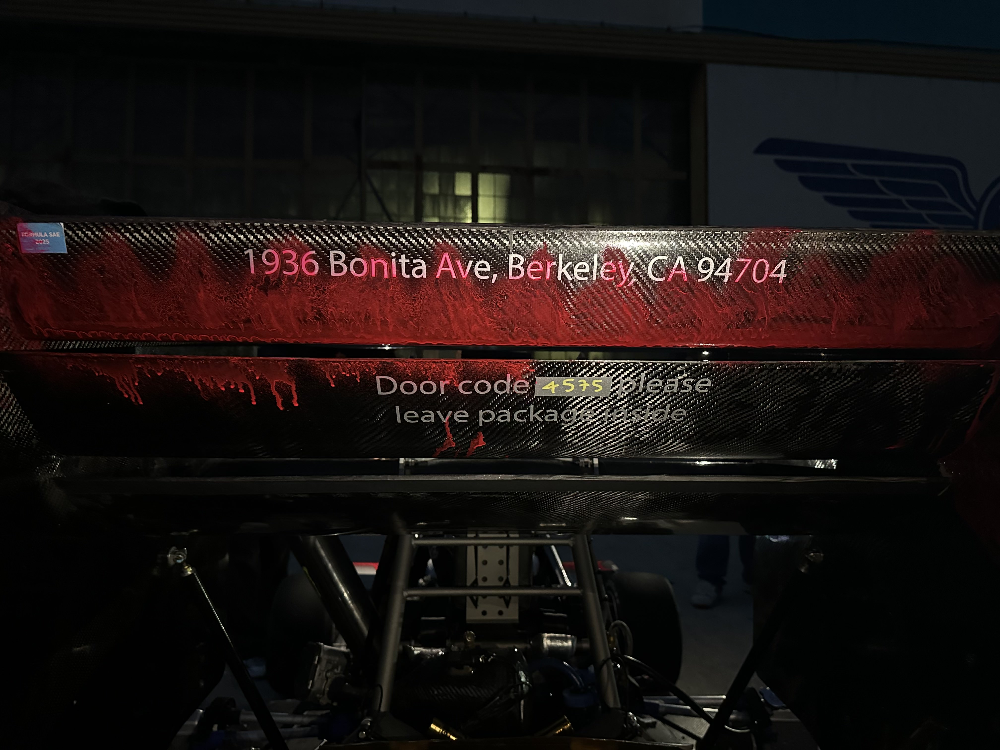
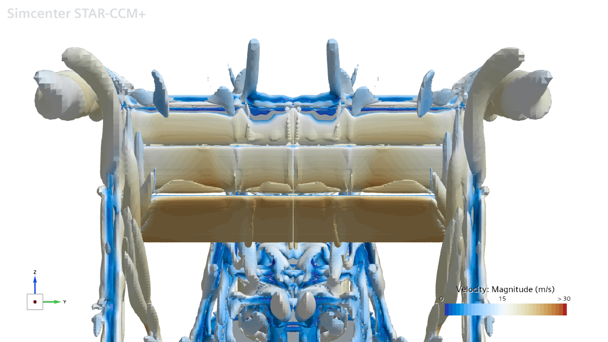

# Rear Wing Flow Visualization

**Berkeley Formula Racing - B26 - On-track testing at competition speed**

Two independent flow visualization methods on the B26 rear wing flaps (elements 2 and 3), both run on track at full competition speed: surface oil-flow, and yarn tufts filmed from an onboard rearward-facing camera. The oil-flow is a fluorescent oil-and-pigment mixture applied before a run, where local shear streaks it in the direction of flow, so regions swept clean mark high-shear attached flow while pooling or diffuse coverage marks low shear or separation. The tufts show the flow directly and in real time. Between them, and read against CFD, they identify the same spanwise structure three different ways, and in one case the physical mechanism behind a pattern neither method could explain on its own.

Worth stating up front: the study covered the two flaps rather than the mainplane. In retrospect the mainplane would have been the more obvious target, since it carries more of the load, but the flaps are what got instrumented and what the data covers.

## The spanwise structure

CFD of the rear wing and driver-head region shows the flow varying strongly across the span. Near the swan-neck mounts the flow stays attached, streamlines tight and organized. On the midplane, in the wake of the driver's head, a closed recirculation bubble forms, visible as a tight vortex core:

Taking slices across the span, the pattern is: recirculation reaching up to flap 1 at roughly y=-0.1 (behind the driver's head) and again at y=-0.4 (near the endplate), with a clean band between them at y=-0.2 showing no circulation at all.

Both experimental methods find that same band independently.

## Tufts

<video autoplay loop muted playsinline width="100%" poster="figures/tufts-still.png">
  <source src="figures/tufts-video.mp4" type="video/mp4">
  Video not supported in this browser. See the still frame above.
</video>
*Onboard footage, roughly 30 seconds, looped and muted. Drop the exported clip in at `figures/tufts-video.mp4` to go live.*

Across the full clip, tufts nearest the swan necks stay flat and attached for the entire run and never separate once. Directly behind the driver's head, between the swan necks, the tufts move constantly, consistent with the recirculation bubble CFD predicts at that station.

Further outboard toward the endplates, the picture is more interesting: tufts stay attached through straight-line sections but separate in corners. Current CFD is straight-line only, so this isn't a confirmed match, it's an open finding. It may be the more valuable one. The footage is showing a real, corner-dependent flow state that a straight-line sweep has no way to predict, which is a concrete physical argument for running a cornering sweep rather than a nice-to-have.

## Oil-flow, pressure side

Flap 2 is clean: no clumping or pooling, consistent both spanwise and chordwise, indicating moderate to strong attachment across the element.

Flap 1 shows more structure. There are two or three vertical clumps near mid-span, behind the driver's head and slightly outboard, and a further sizeable patch near the endplate. Critically, there is a clear gap between the mid-span clumps and the outboard patch, and that gap sits at the spanwise station where CFD shows clean flow. The oil-flow, the tufts, and the CFD all place the attached band in the same place, by three different methods.

One caveat on reading this image. Some pooling near the leading edge is an artifact rather than a flow feature: the mixture was sprayed on and the car took a moment to launch, so gravity drained some of it before there was any airflow to work with. Pooling from drainage looks much like pooling from low shear, so that region is not diagnostic.

The clumps are not just qualitatively consistent with CFD, they line up with an actual flow structure. Overlaying the blotting pattern against a Q-criterion isosurface (threshold 10,000 s⁻²) from the same simulation shows discrete streamwise vortex legs shedding off the wing at close to the same spanwise stations as the clumps on the real part:

The clumps are not pooling or an application artifact. They are the surface footprint of vortices that CFD predicts convecting through almost exactly those locations.

## Oil-flow, suction side

The suction side shows a pronounced sawtooth streaking pattern, fine and closely spaced, running almost the full span of the element.

The same Q-criterion field explains this too. From behind, the simulation shows a row of discrete vortex structures sitting right where the sawtooth appears:

The mechanism is the same one behind the pressure-side clumps: streamwise vortex legs, cleared by high shear where they pass and leaving pooled oil in the low-shear gaps between them. That much is now well supported rather than speculative.

What doesn't match is the scale. CFD resolves roughly six or seven distinct vortex legs across the span, unevenly spaced and clustered mainly behind the driver's head. The real wing shows dozens of fine, closely and evenly spaced streaks running almost uniformly across the entire span, a much finer spatial wavelength than anything in the simulation. CFD has the right physics and the right general location, but the real flow is shedding vortices at a spacing the simulation isn't resolving.

A likely explanation is that this is a steady RANS limitation rather than a modeling error. A naturally-arising, evenly-spaced spanwise instability is an inherently unsteady phenomenon, and a steady solver tends to only resolve larger, discrete structures tied to explicit geometric or wake features, in this case the driver's head, rather than a fine, regular pattern arising on its own across a mostly uniform span. Confirming that would need a scale-resolving run, DES or similar, rather than steady RANS. Worth stating as the likely explanation rather than a settled one.

## Why this matters

Flow visualization is the only place in the B26/B27 development cycle where a flow assumption gets checked against the real car rather than against another simulation. The spanwise result is the strongest confirmation: recirculation behind the driver's head, a clean band outboard of it, separation again near the endplate, identified independently by CFD, tufts, and oil-flow. The vortex correlation goes a step further: it isn't just agreement on where the flow separates, it identifies the physical mechanism causing the streaking pattern on both surfaces, with the remaining discrepancy, spacing and uniformity rather than location, pointing at a specific and answerable next question about the simulation rather than a vague one. The corner-dependent endplate behavior in the tuft footage is a separate, direct argument for the cornering sweep the team hasn't run yet.
