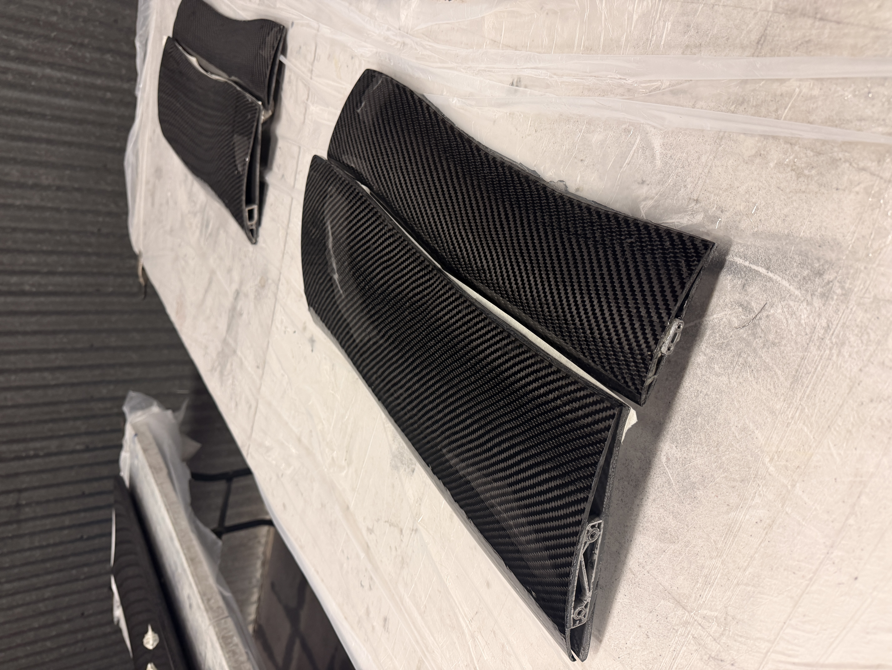
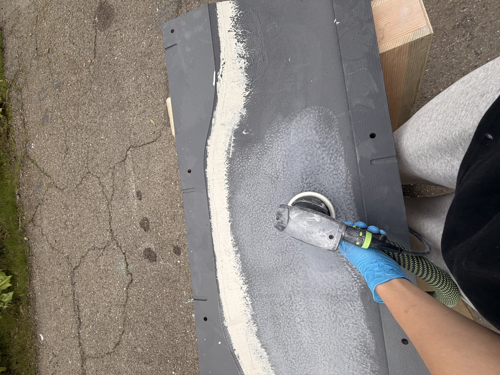
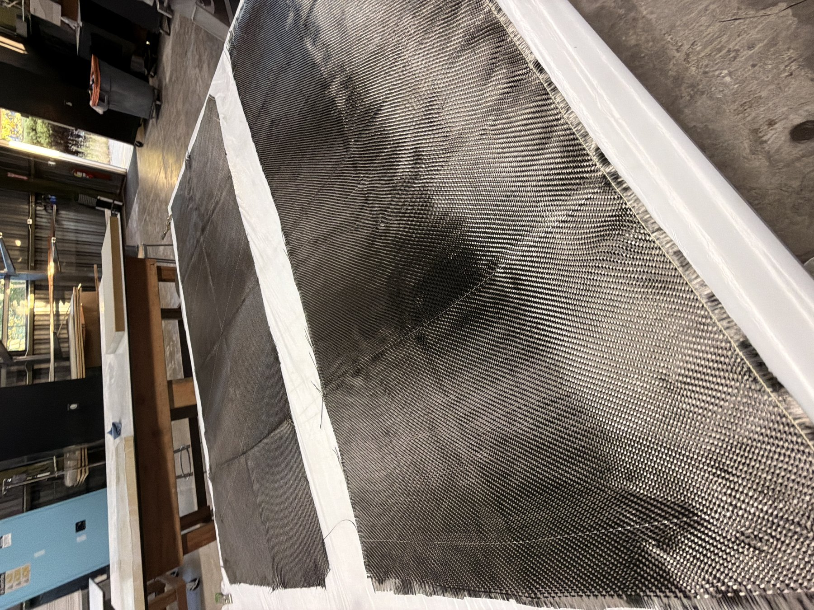
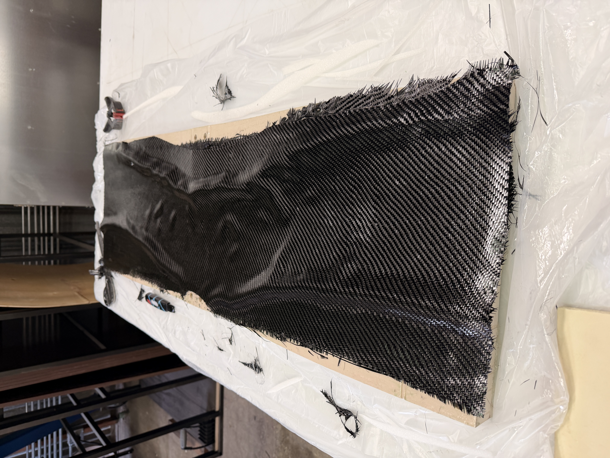
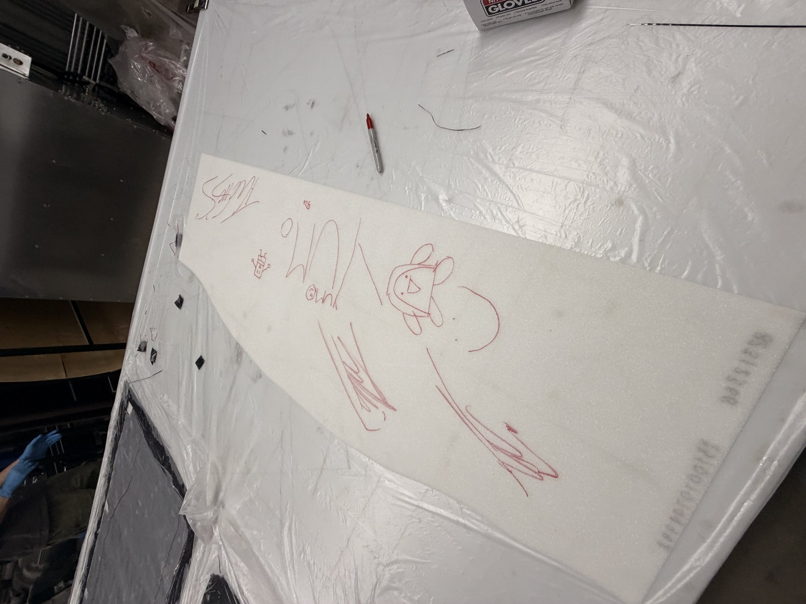
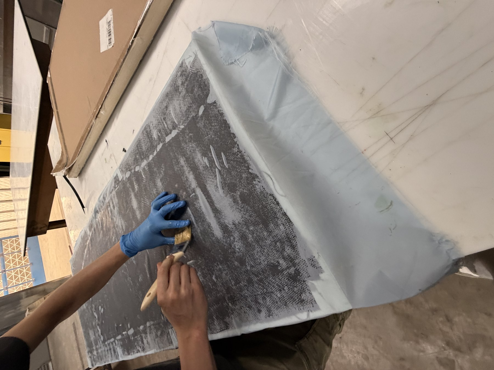
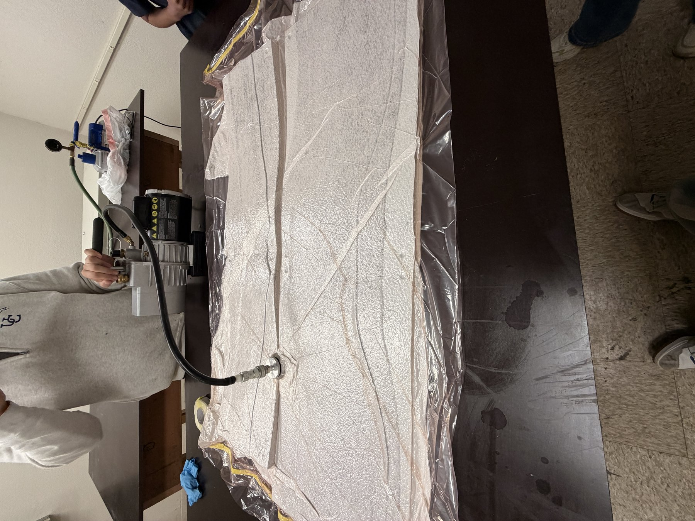
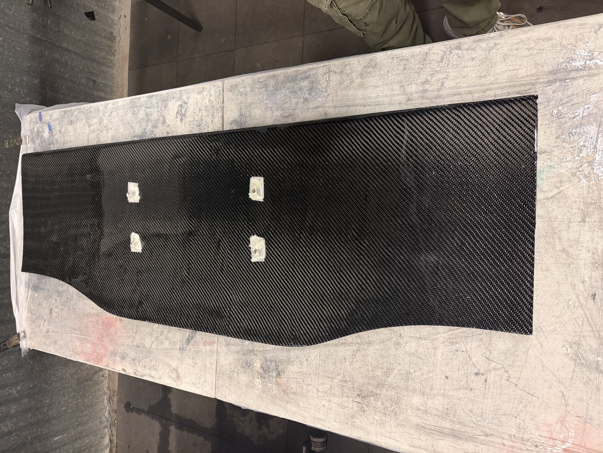

# Composites Manufacturing

**Berkeley Formula Racing - B27 front wing elements**
CNC-machined foam tooling, wet layup, carbon post-processing

The front wing elements go from a machined foam mold to a finished carbon part entirely in-house. The process is a fairly standard wet-layup construction, but the finish quality comes down to a lot of unglamorous sanding at both ends of it, on the mold before layup and on the part after curing.

## Mold and surface prep

Molds are machined from high-density foam on the team's ShopSabre CNC, then coated in Duratec, a surfacing primer that fills the foam's porous surface and applies a polishable surface. From there, it is a long grit progression on an orbital sander: 80, 120, 200, 400, 600, 800, 1000, 1500, then 2000, finished with wax. Since this is a female mold, whatever finish goes onto the tool comes off on the part, so this stage sets the ceiling for how good the final surface can look.

## Layup

Plies are cut at 0 and 45 degrees, two per half, with epoxy brushed on by hand. The layup is a symmetric sandwich: 0, 45, a Rohacell foam core, then 45, 0 again, mirrored to keep the laminate balanced and prevent warping as it cures.

Before the core goes in, whoever is working on the layup signs it. It serves no structural purpose and does not alter the visual finish of the car, but it's a long-standing aero team tradition on every component the team lays up. Our way of leaving our legacy on the cars we build. 

## Vacuum bagging and cure

A layer of peel ply goes directly over the part, under the breather and bag, so the two can be pulled off cleanly after cure without taking the surface with them. The whole stack is then sealed under vacuum, roughly 25 inHg, using yellow sealant tape around the tool perimeter to hold the bag down while it cures.

## Finish and result

After demolding, the part gets a quick finish sand at 1500 and 2000 grit, a coat of wax, and two coats of clear. Elements 2 and 3 (very first image) in particular came out particularly well. The reflective carbon finish is beautiful and is usually one of the first parts people look at on the car. 

The mold and layup process above is shared between every carbon part on our cars, from wing elements to the nosecone and undertray.
