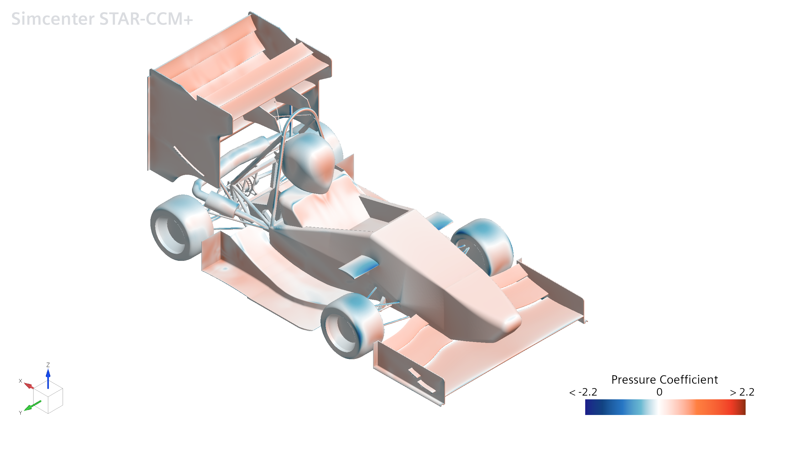
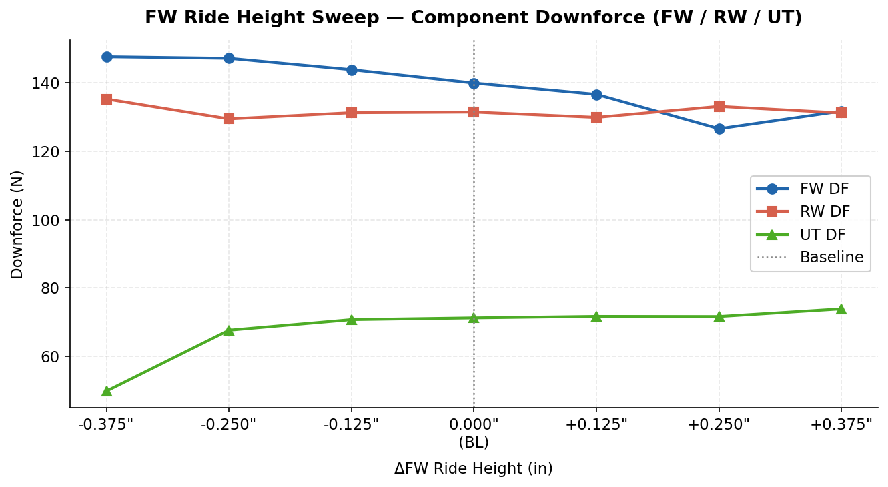
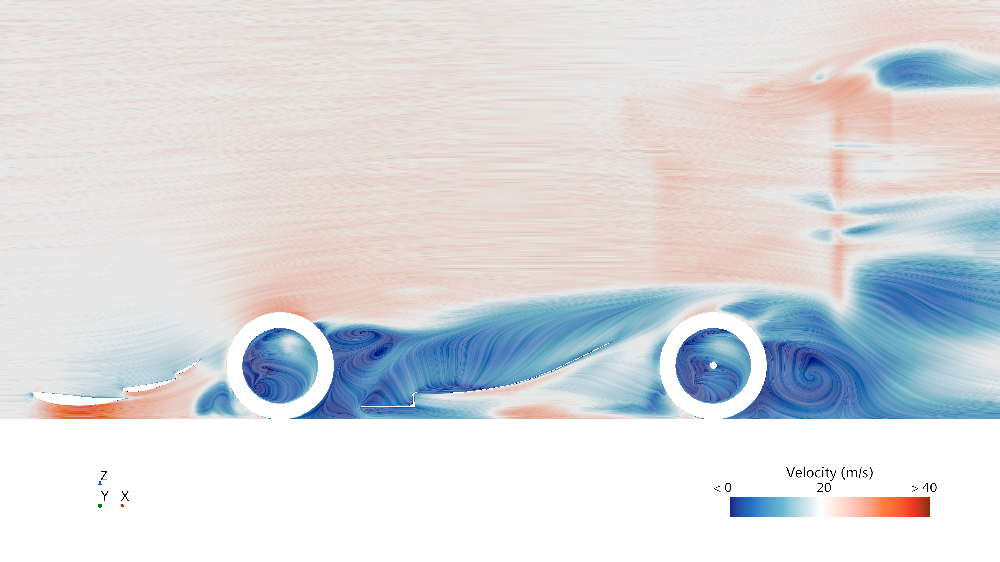
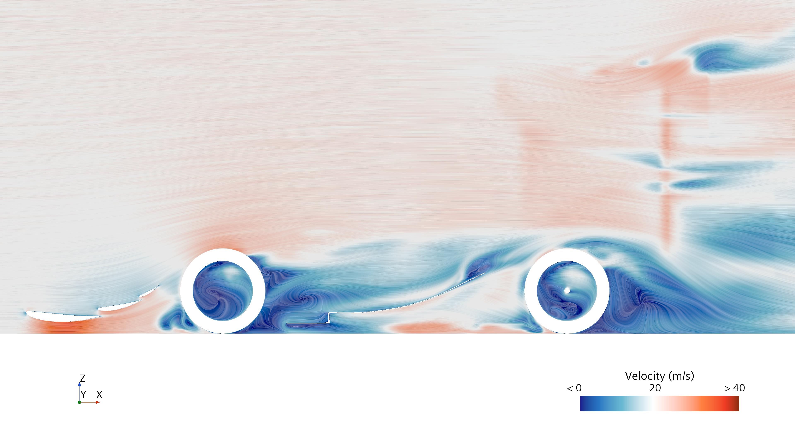

# Front Wing Sensitivity & Aeromap Study

**Berkeley Formula Racing - B26 - Simcenter STAR-CCM+**
Half-car RANS, 37M cells - 7 mounting positions at 0.125" spacing

The B27 front wing bolts to the nose through a hole pattern giving seven fixed installation heights, +/-0.375" from baseline. The general rule that a lower ground-effect dependent element is better does not exactly hold true. Beyond a certain point, the undertray starts losing more downforce than the front wing gains. There is also a hard mechanical floor, since running the wing too low risks it scraping the ground during corner entry. I ran all seven positions in CFD to find where those two limits actually land.

## The undertray starves before the front wing saturates

Going from -0.250" to -0.375":

| Component | -0.250" | -0.375" | D |
|---|---|---|---|
| Front wing | 147.16 N | 147.62 N | **+0.46** |
| Undertray | 67.67 N | 49.91 N | **-17.75** |
| Rear wing | 129.47 N | 135.27 N | +5.80 |

The front wing has already saturated. Its gain over that last step is 0.46 N, against 3.33 N the step before. The undertray, meanwhile, loses 26% of its downforce in that one position. Optimizing the front wing in isolation would have picked the worst position on the car.

The mechanism appears to be downstream of the tire:

| -0.375" | -0.250" |
|---|---|
|  |  |

At the correct height, the front wing's inboard vortex deflects the front-tire wake ("tire squirt") clear of the undertray leading edge. At -0.375" the wing sits too low, and the vortex it sheds doesn't persist long enough to do that job, so the tire wake wraps inboard and floods the undertray inlet with turbulent, low-momentum air instead. That's why the undertray's force output collapses even though nothing about the undertray's geometry changed. Too low of a front wing feeds the undertray lower quality air. 

## Result

-0.125" gave the best downforce of the seven positions without crossing the scraping limit, and was run for the rest of competition.
