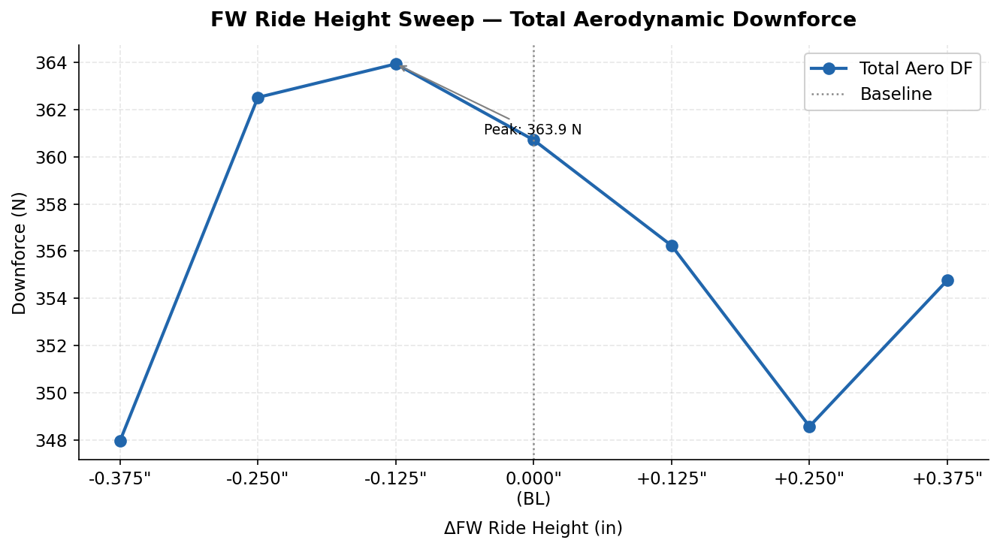
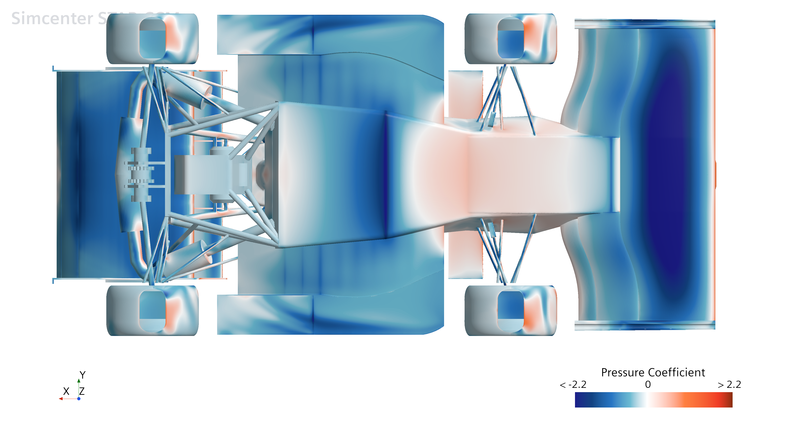

# Front Wing Mounting Position Study

**Berkeley Formula Racing - B27 - Simcenter STAR-CCM+**
Half-car RANS, 37M cells - 7 discrete mounting positions at 0.125" spacing

The B27 front wing bolts to the nose through a hole pattern giving seven fixed installation heights, +/-0.375" about nominal, an in-season setup adjustment that had never been characterized. I ran all seven as half-car RANS cases and found that the obvious answer, "lower is more downforce," is wrong past a specific point, for a reason that only shows up once you look at the flow rather than just the force totals.

## Total load

Total downforce peaks at -0.125" (363.9 N), 3.2 N above nominal, and falls off toward both extremes: a 4.4% range across the full sweep. Center of pressure moves 45.7-52.3% of wheelbase over the same range, so the holes double as a meaningful balance adjustment at comparatively low cost to total load.

## The undertray starves before the front wing saturates

Breaking the total down by component tells a sharper story than the total does alone. Going from -0.250" to -0.375":

| Component | -0.250" | -0.375" | D |
|---|---|---|---|
| Front wing | 147.16 N | 147.62 N | **+0.46** |
| Undertray | 67.67 N | 49.91 N | **-17.75** |
| Rear wing | 129.47 N | 135.27 N | +5.80 |

The front wing has already saturated. Its gain over that last step is 0.46 N, versus 3.33 N the step before. The undertray, meanwhile, loses 26% of its downforce in that one position. **Optimizing the front wing in isolation would have picked the worst position on the car.**

The mechanism is downstream of the tire, not the floor itself: plan-view and bottom-surface Cp on the undertray barely change across the whole sweep (below). What changes is what's arriving at the undertray inlet:

| -0.375" | -0.250" |
|---|---|
|  |  |

At the correct height, the front wing's inboard vortex deflects the front-tire wake ("tire squirt") clear of the undertray leading edge. At -0.375" the wing sits too low, and the vortex it sheds doesn't persist long enough to do that job, so the tire wake wraps inboard and floods the undertray inlet with turbulent, low-momentum air instead. That's why the floor's own pressure field is undisturbed (below) while its force output collapses: the undertray isn't being interfered with geometrically, it's being fed worse air.

Two independent readings of this dataset, force integration and flow-structure inspection, done separately, land in the same place: -0.125" for peak total load, -0.250"/-0.125" as the best-behaved pair overall, -0.375" as the clear failure mode.

One case doesn't fit the pattern. At +0.375" every monitor reverses direction after five monotonic points, and the floor Cp there looks the same as everywhere else, so it isn't a geometric effect on the floor. Flagged as unresolved rather than smoothed over; likely a mesh or convergence issue specific to that run, not re-simulated as of writing.

**Delivered to vehicle dynamics** as a per-hole aeromap (load + balance) for lap-simulation input.

*Force monitor convergence histories weren't retained for this study. A post-hoc noise floor was estimated from a component (the whisker) known to be insensitive to front-wing height, giving sigma ~ 0.07 N, and the two findings above exceed that by one to two orders of magnitude. RANS also underpredicts separation on a car with regions as large as this one, so absolute force levels are best read as estimates; the deltas and trends are the reliable part.*
