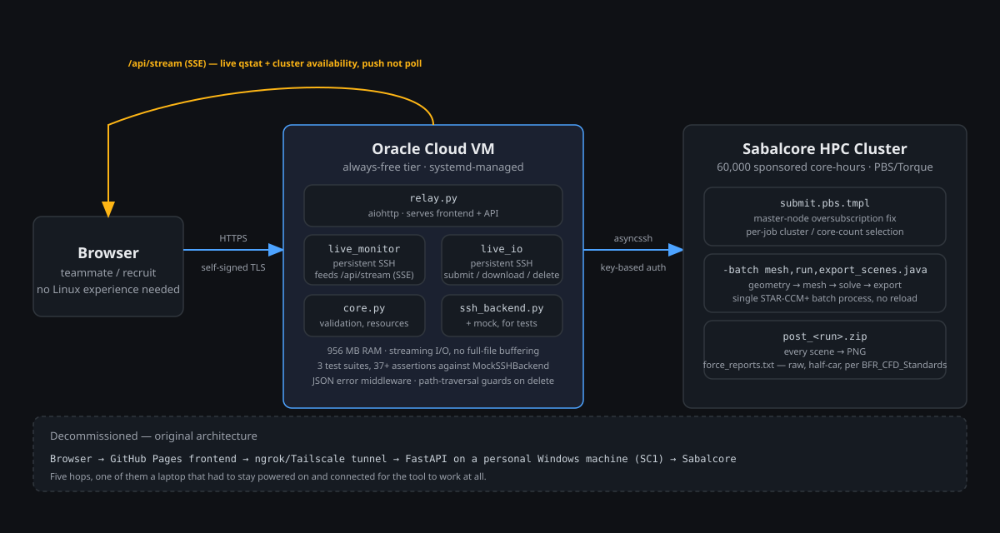
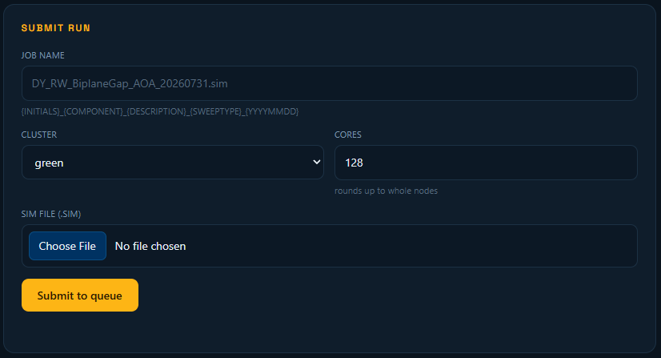
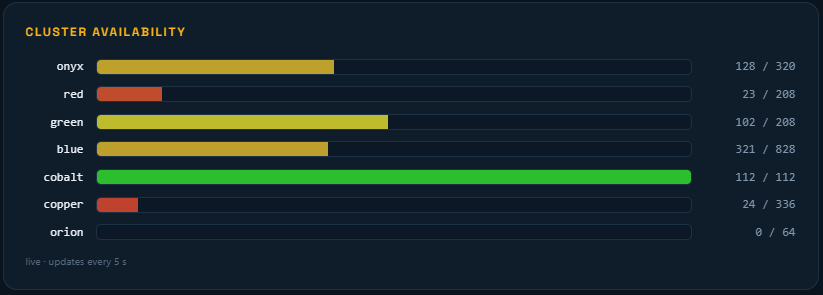
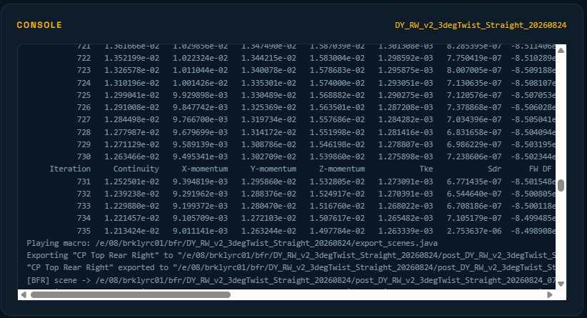
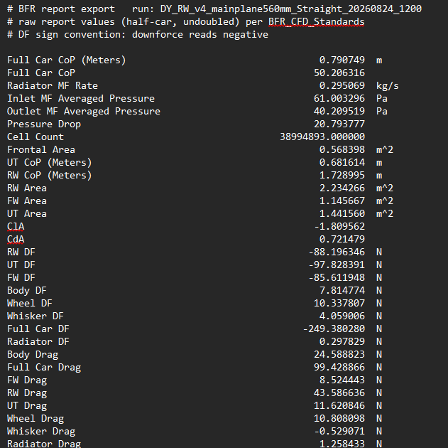
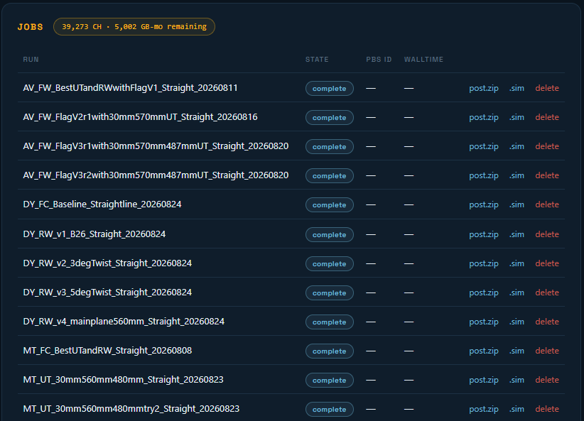

# BFR HPC Job Relay

**Berkeley Formula Racing - Python, aiohttp, asyncssh - Oracle Cloud + Sabalcore**
~140 simulations run, 20,000+ core-hours consumed, 10 active users

BFR runs CFD on Sabalcore, an external HPC provider, via a 60,000-core-hour sponsorship I secured for the 2026 season alongside a STAR-CCM+ Power-on-Demand license. Getting a job from a teammate's laptop onto that cluster, and a result back, is a problem most FSAE teams solve badly or not at all: it usually means SSH, PBS scripting, and manual SFTP, which puts CFD out of reach for anyone who isn't already comfortable on the command line. I built and now maintain the tool that makes that not true for our team.

## Why it needed rebuilding

The first version worked, barely, and only when it worked at all. A GitHub Pages frontend talked to a FastAPI backend running on my personal Windows machine, reached from outside campus network through an ngrok/Tailscale tunnel, which then SSH'd into Sabalcore. Five hops, and one of them was a laptop that had to be powered on, connected, and un-slept for any teammate to submit a job. It failed constantly and in ways that were hard to diagnose, because the failure could be in any of five places.

I decommissioned all of it and rebuilt from a different starting question: what's the minimum number of hops with zero dependency on a personal machine. The answer is a relay that lives entirely on infrastructure that stays online by itself, a small always-on cloud VM serving the frontend directly and holding the only SSH connection to the cluster. That collapses five hops to two, and removes "is my laptop asleep" as a failure mode entirely.

## What it does

A teammate opens the tool, logs in, and gets four panels: submit, live job monitor, jobs/download, and cluster availability. Submitting a job means picking a `.sim` file, a cluster partition, and a core count. The backend validates that core count against each partition's actual node size (16 cores/node on most partitions, 36 on one, 24 and 64 on others) so a teammate can't request something the scheduler will reject, and generates the PBS script from a template reconciled line-for-line against the cluster admin's own working script, including a master-node oversubscription fix that was costing the team a 13x slowdown before I found and fixed it in an earlier pass on this project. The job-name field enforces the team's naming convention directly in the placeholder text, so a run is self-describing before it's even submitted.

Once submitted, STAR-CCM+ runs a single chained batch process on the cluster: geometry operations, meshing, solving, and a post-processing export macro, all in one job, operating on the same in-memory solved simulation rather than reloading it for a separate export step. The console streams live, so a teammate can watch solver residuals converge and then watch the export macro fire against the finished solution without leaving the browser:

That macro writes every scene to PNG and every report value to a text file, formatted to the team's own CFD standards document (raw values, half-car, undoubled, with a locked downforce sign convention) so results are consistent regardless of who ran the job:

Results come back as a single zip a teammate can pull from the jobs panel.

The cluster monitor and job status update live via server-sent events rather than polling, so a teammate watching a run doesn't refresh a page; the page pushes to them. That required moving off a naive per-request-SSH-connection model, which was failing intermittently under load, to two persistent SSH sessions held open by the relay: one dedicated to the live monitoring feed, one to submit/download/delete actions, so a slow download can't stall someone else's status update.

## Under the hood

The backend is a handful of focused Python modules: request handling and the frontend server, job validation and resource checking, and an SSH backend with a mock implementation swapped in for testing, so the submission and validation logic has real test coverage without needing a live cluster connection for every run. The service is deployed under systemd for automatic restart, served over TLS, and authenticates to the cluster with a dedicated SSH key rather than a shared password.

Getting it running exposed a few things nobody had documented anywhere. The cluster's actual home-directory path didn't match its own documentation, `qstat` output needed a proper key-value parser after the naive columnar one silently produced wrong job states, and the partition-availability parser broke on one specific partition name because it happened to contain the letter the field-splitter was matching on. None of that shows up in a demo; all of it is why the tool works reliably now instead of intermittently.

## Standards, not just software

Building the pipeline surfaced a second problem: even with reliable job submission, results from different teammates weren't directly comparable, because nobody had written down the team's conventions for coordinate systems, reference values, half-car doubling, boundary naming, or sign conventions. I authored `BFR_CFD_Standards.md` to lock those down: reference flow conditions, a two-namespace part-naming scheme, mesh and solver baselines, a run-naming convention, and a pre-run checklist, so a `.sim` file from any team member means the same thing. The post-processing macro enforces the reporting half of that standard automatically rather than relying on everyone remembering it.

## Result

Ten people, five returning teammates and five new recruits with no prior HPC experience, are running CFD through this tool without touching SSH, PBS, or a terminal. The team has run roughly 140 simulations and consumed over 20,000 of the sponsored core-hours through it this season.

