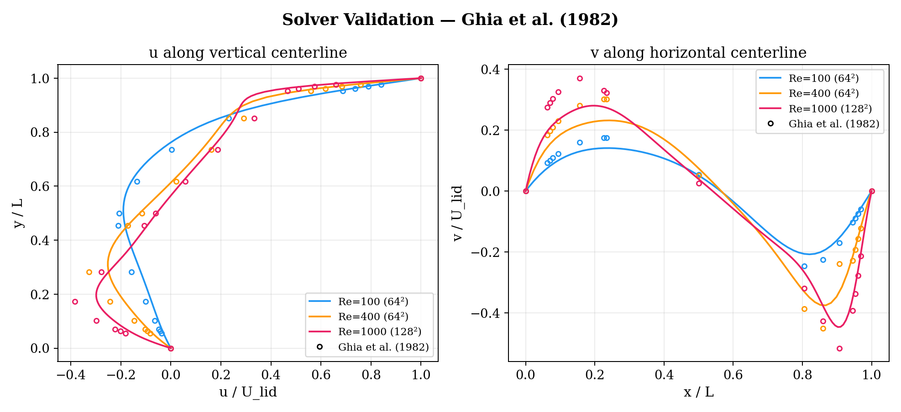
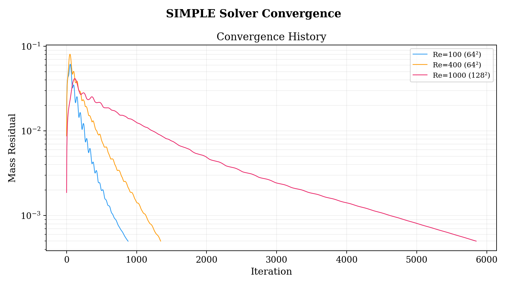
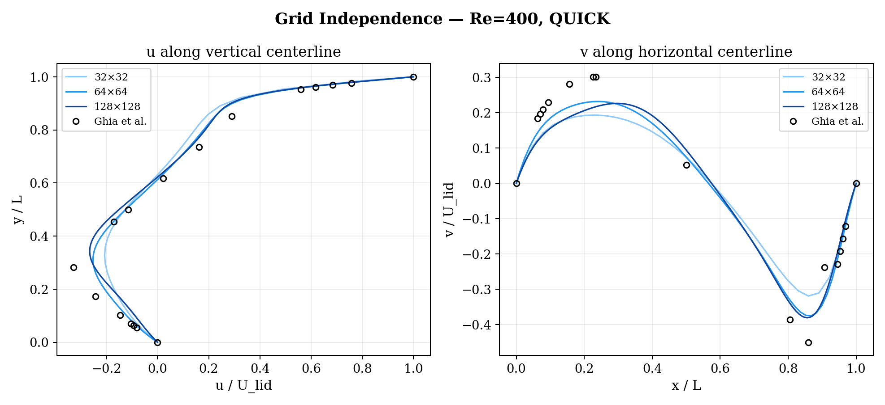
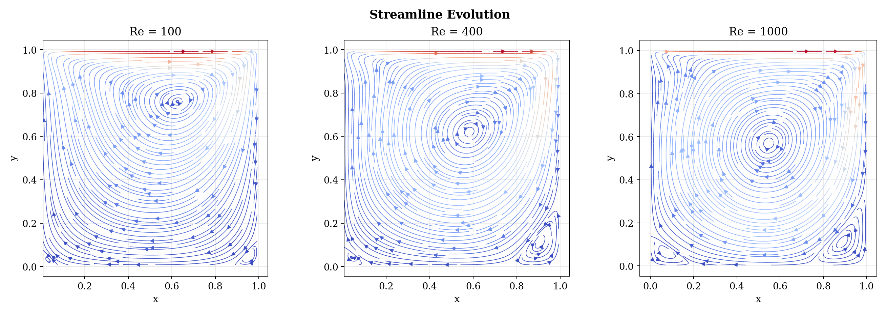
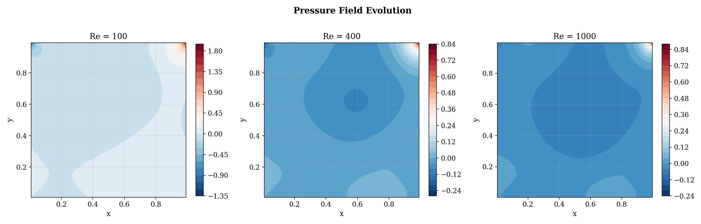
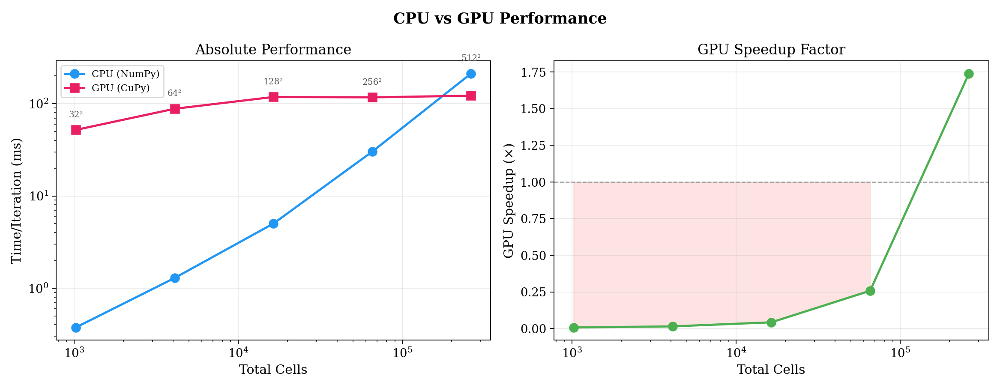
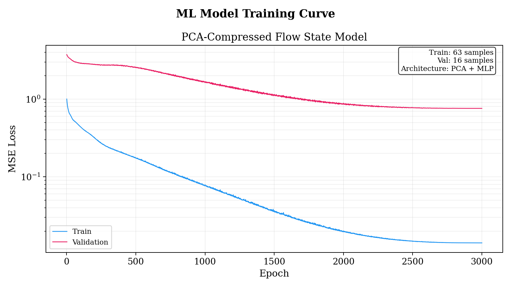
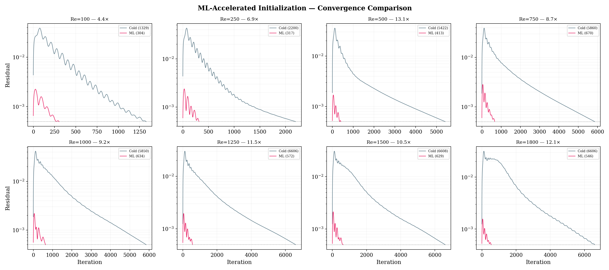
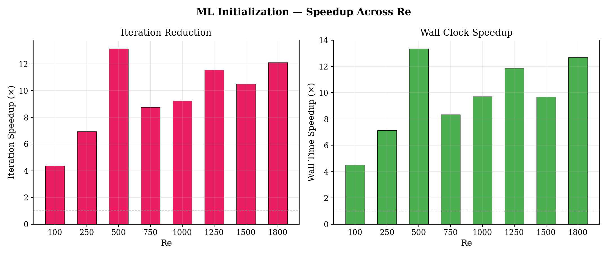

# 2D Navier-Stokes Solver, ML-Accelerated

**Python (NumPy/SciPy, CuPy, PyTorch) - [github.com/dohyuny7/navier-stokes-ml](https://github.com/dohyuny7/navier-stokes-ml)**
SIMPLE algorithm, QUICK convection, staggered MAC grid - validated against Ghia, Ghia & Shin (1982)

A 2D incompressible Navier-Stokes solver built from first principles: the same algorithm family (SIMPLE pressure-velocity coupling, staggered grid, QUICK convection) that runs inside STAR-CCM+ and Fluent, implemented transparently rather than treated as a black box. Then extended with a small neural network that predicts a converged flow state and hands it to the solver as an initial guess, cutting iteration count by 4-13x depending on Reynolds number.

## The solver

Discretization is finite-volume on a staggered MAC grid, with pressure at cell centers and velocity components on the faces between them, which avoids checkerboard pressure oscillations without needing Rhie-Chow interpolation. Convection uses QUICK via deferred correction: an upwind-implicit part for diagonal dominance, plus an explicit correction term that recovers third-order accuracy. Pressure-velocity coupling is SIMPLE, with the pressure correction solved by a cached sparse LU factorization, refactorized periodically rather than every iteration, for a 5x reduction in solve time.

Validated against the lid-driven cavity benchmark from Ghia, Ghia & Shin (1982) at Re = 100, 400, and 1000. Centerline velocity profiles land on the reference points across all three:

The raw convergence behavior behind that validation, mass residual against iteration for all three cases, shows the expected shape: a short transient rise while the flow field develops from a zero initial condition, then roughly exponential decay to the 5x10^-4 tolerance. Re = 1000 needs about 5,850 iterations to get there, the number the ML-acceleration section below is built around:

Grid independence confirmed at Re = 400 across 32x32, 64x64, and 128x128:

## Flow physics

The primary recirculation and the secondary corner vortices develop as expected with increasing Re, visible as small counter-rotating cells in the bottom corners by Re = 1000 and absent at Re = 100:

## GPU backend

A CuPy backend lets the same solver run on GPU with no code changes at the call site. It's not a universal win: at this problem's memory-bound, small-kernel scale, GPU dispatch overhead dominates below roughly 2x10^5 cells, and CPU is faster for most of the grid sizes actually used here. The crossover sits close to the 512x512 mesh.

## ML-accelerated initialization

The solver's real bottleneck is iteration count from a cold start. Re = 1000 takes roughly 6,000 SIMPLE iterations from u=v=p=0, because the flow field has to develop from nothing. I trained a small network (SVD/PCA compression to ~6 modes capturing 99.95% of variance, then a 2-layer MLP with ~4,700 parameters) to map Reynolds number directly to the converged flow state. At inference, that prediction replaces the zero initial condition. The physics doesn't change: same solver, same convergence tolerance, same governing equations, only a different starting point.

79 converged solutions total, split 63 train and 16 validation. Training MSE drops smoothly to about 0.02 over 3,000 epochs; validation MSE also decreases monotonically, with no sign of the network overfitting and diverging, but it plateaus much higher, around 0.8. That gap is worth stating plainly rather than smoothing over. The most likely cause is the validation set itself: 16 points is small enough that the metric is dominated by whichever few Reynolds numbers happen to fall in it, especially near the edges of the training range where the model has less to interpolate from. It is not evidence of the runaway overfitting that a rising validation curve would show, but the gap is real and the honest read is that the validation loss number should be treated as noisy rather than precise.

Trained on 79 converged solutions from Re = 25 to 2000, with PCA fit on the training set only. Across the eight-point sweep shown above, wall-clock speedup runs 4.4x-13.4x, with no case doing worse than cold start:

## Limitations

The comparison baseline is a cold start, which is fair for a single one-off solve but not for a full Re sweep. Standard CFD practice would warm-start each new Re from the previous one's converged solution instead, a technique called continuation, and I haven't benchmarked against that yet, though it would be a stronger test. The network is also trained for one fixed geometry (the unit square cavity) with Re as the only input, so it's really an efficient interpolator over a single scalar rather than a general solver replacement. It cannot generalize to a different domain shape without retraining the PCA basis from scratch; doing that properly would mean moving to a geometry-aware architecture like a graph network or a Fourier neural operator, rather than extending this one. And the whole approach is steady-state, so it has no way to represent vortex shedding or the unsteady transition that eventually appears in this exact flow well past the tested Re range.

Full derivation, CLI reference, and reproduction instructions are in the repo.
